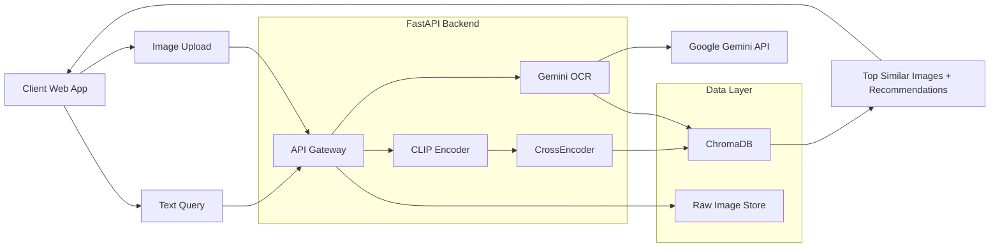

# Multimodal Search Application

A powerful search system that allows users to find jewelry items using text, images, and handwriting (OCR). This application leverages advanced AI models for semantic understanding and retrieval.


## Features

- **Text Search**: Search for items using natural language descriptions.


- **Image Search**: Upload an image to find visually similar items.


- **OCR Search**: Upload images with handwritten text to extract and search based on the content.


- **Reranking**: Improves search relevance using a Cross-Encoder model.
- **Hybrid Search**: Combines vector embeddings (CLIP) with semantic reranking.

## 🚀 Architecture

The system consists of a React frontend and a FastAPI backend, utilizing ChromaDB for vector storage and various AI models for processing.



<br/>
<br/>

## 📸 Sample Search Results

<div align="center">

### 🔍 Text Search Result


<br/><br/>

### 🖼️ Image Search Result


<br/><br/>

### ✍️ OCR Search Result


</div>

<br/>
<br/>


## 🛠️ Tech Stack

### Backend
- **Framework**: FastAPI
- **Language**: Python 3.8+
- **Vector DB**: ChromaDB
- **Models**:
  - CLIP (`ViT-L/14`) for embeddings
  - CrossEncoder (`ms-marco-MiniLM-L-6-v2`) for reranking
  - Google Gemini 2.5 Flash for OCR
- **Libraries**: PyTorch, Pillow, Sentence-Transformers

### Frontend
- **Framework**: React 19
- **Build Tool**: Vite
- **Styling**: CSS Modules / Custom CSS
- **HTTP Client**: Axios

## 📦 Installation

### Prerequisites
- Python 3.8+
- Node.js & npm
- OpenAI API Key (for Gemini OCR functionality)

### Backend Setup

1.  Navigate to the backend directory:
    ```bash
    cd backend
    ```

2.  Create a virtual environment (optional but recommended):
    ```bash
    python -m venv .venv
    # Windows
    .venv\Scripts\activate
    # macOS/Linux
    source .venv/bin/activate
    ```

3.  Install dependencies:
    ```bash
    pip install -r requirements.txt
    ```

4.  Set up environment variables:
    Create a `.env` file in the `backend` folder and add your API key:
    ```env
    OPENAI_API_KEY=your_api_key_here
    OPENAI_BASE_URL=https://generativelanguage.googleapis.com/v1beta/openai/
    ```

5.  Run the server:
    ```bash
    uvicorn backend:app --reload
    ```
    The API will be available at `http://localhost:8000`.

### Frontend Setup

1.  Navigate to the frontend directory:
    ```bash
    cd frontend
    ```

2.  Install dependencies:
    ```bash
    npm install
    ```

3.  Start the development server:
    ```bash
    npm run dev
    ```
    The application will be available at `http://localhost:5173`.

## 📖 Usage

1.  **Text Search**: Enter a description (e.g., "gold necklace with ruby") in the search bar and press enter.
2.  **Image Search**: Click the camera icon or drag & drop an image to search for similar jewelry.
3.  **OCR Search**: Switch to the OCR tab to upload an image with text (e.g., a handwritten tag) to search based on the text.
4.  **Reranking**: Toggle the "Use Reranking" switch to improve result accuracy (may be slower).


## 📡 API Endpoints

-   `GET /`: Health check and API info.
-   `POST /api/search/text`: Search using text queries.
-   `POST /api/search/image`: Search using image uploads.
-   `POST /api/search/ocr`: Extract text from image and search.


